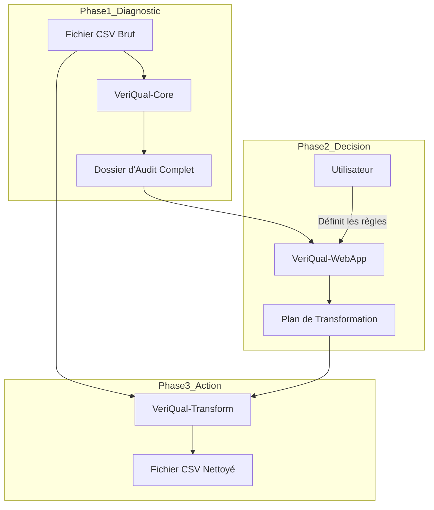
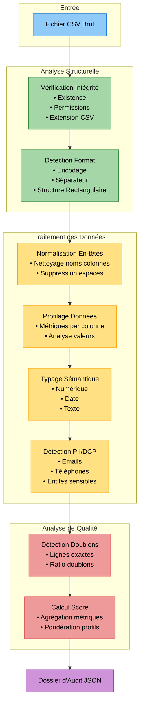
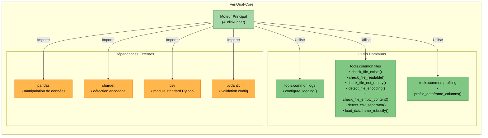

## ✅ VeriQual-Core - V1.5 - Spécification Fonctionnelle Finale (Version Complétée et Suivie)

### 🔖 Métadonnées

- **Nom du Document :** VeriQual-Core - V1.5 - Spécification Fonctionnelle Finale
    
- **Catégorie :** Spécification Fonctionnelle de Module
    
- **Statut :** ✅ Validé pour Développement
    

### 📋 SUIVI DES PRINCIPALES RÉVISIONS

| Date           | Auteur(s)      | Version   | Source des modifications                                                                       |
| -------------- | -------------- | --------- | ---------------------------------------------------------------------------------------------- |
| 12/05/2024     | FARA NIANG     | 1.0       | Spécification initiale validée                                                                 |
| 20/07/2025     | FARA NIANG     | 1.5       | Intégration de toutes les décisions validées F-01 / F-02 (encodage, séparateur, en-têtes)      |
| 23/07/2025     | FARA NIANG     | 1.5.1     | Ajout du tableau de révisions + précisions sur les exclusions et stratégies de repli           |
| 23/07/2025     | FARA NIANG     | 1.5.2     | Intégration des diagrammes d'architecture et de workflow au format Obsidian/Mermaid            |
| 23/07/2025     | FARA NIANG     | 1.5.3     | Correction de la syntaxe du diagramme "Architecture Générale" pour compatibilité Obsidian      |
| 29/07/2025     | FARA NIANG     | 1.5.4     | Séparation du module de profilage (`tools/common/profiling.py`) et mise à jour des diagrammes. |
| 29/07/2025     | FARA NIANG     | 1.5.5     | Correction du formatage des blocs JSON pour compatibilité Obsidian.                            |
| **29/07/2025** | **FARA NIANG** | **1.5.6** | **Application du formatage Mermaid validé pour tous les diagrammes.**                          |

### 1. 🎯 Mission du Module

Le module `VeriQual-Core` est le **moteur d’analyse central** de l’écosystème VeriQual. Sa mission est d’auditer un fichier CSV pour produire un **dossier d’audit structuré**, quantifiant objectivement sa qualité.

Ce diagnostic est la **Phase 1** du workflow général :



### 2. 🧱 Périmètre de la V1

|✅ Inclus (automatique)|❌ Exclu (pour V2+)|
|---|---|
|Analyse de fichiers **CSV**.|Modification du fichier source (lecture seule).|
|Détection automatique de l'encodage et du séparateur.|Forçage manuel de l'encodage/séparateur.|
|Nettoyage de base des en-têtes.|Normalisation avancée des en-têtes (casse, caractères).|
|Détection sémantique des types.|Forçage manuel des types par colonne.|
|Calcul d’un score de qualité paramétrable.|Interface graphique ou ligne de commande.|
|**Dépendances externes : `chardet` et `pandas` (acceptées).**|**Vérification de l'extension du fichier (règle métier).**|

### 3. ⚙️ Spécifications Fonctionnelles (Détail V1)

Voici le workflow des fonctionnalités au sein de VeriQual-Core :



#### F-01 : Analyse Structurelle

> Valide l'intégrité technique du fichier (existence, lisibilité, encodage, séparateur, structure rectangulaire, contenu significatif).

**Détails d'implémentation V1 :**

- **Vérification d'existence (`check_file_exists`) :** Vérifie l'existence et la nature "fichier", distingue les liens symboliques brisés.
    
- **Vérification de lisibilité (`check_file_readable`) :** Vérifie les permissions de lecture.
    
- **Vérification de non-vide (`check_file_not_empty`) :** Vérifie que la taille du fichier est > 0 octets.
    
- **Détection d'encodage (`detect_file_encoding`) :**
    
    - Lit un échantillon de **128 KB**.
        
    - Utilise `chardet` pour la détection initiale.
        
    - Si `chardet` est incertain (confiance < `_DEFAULT_CONFIDENCE_THRESHOLD = 0.8`) ou échoue, tente une lecture de repli avec `utf-8`.
        
    - Seuls `chardet` avec confiance suffisante ou `utf-8` sont considérés comme des détections "fiables". Les encodages plus permissifs (`latin1`, `windows-1252`) ne sont pas utilisés pour la détection _fiable_ en V1, mais seront des options de forçage en V2.
        
    - Retourne une erreur si aucun encodage fiable n'est détecté.
        
- **Vérification de contenu significatif (`check_file_empty_content`) :**
    
    - Prend l'encodage détecté en paramètre.
        
    - Décode un échantillon du fichier et vérifie si le contenu est vide après `strip()`.
        
    - Assume que `check_file_not_empty` a déjà vérifié la taille > 0 octets.
        
- **Détection du séparateur (`detect_csv_separator`) :**
    
    - **Étape 1 :** Utilise `csv.Sniffer` sur un échantillon pour une détection "intelligente".
        
    - **Étape 2 (repli) :** Si `csv.Sniffer` échoue, tentative de lecture avec `pandas.read_csv` en itérant sur les séparateurs par défaut (`,`, `;`, `\t`). Le premier séparateur qui permet une lecture sans erreur est retenu.
        
- **Vérification de structure rectangulaire :**
    
    - Effectuée lors de la lecture du fichier avec `pandas.read_csv`.
        
    - Les erreurs de parsing (`pd.errors.ParserError`) indiquent une structure non rectangulaire.
        
- **Gestion des erreurs :** Applique une stratégie **`fail-fast`** : l'audit s'arrête dès la première erreur critique détectée.
    

#### F-02 : Normalisation des En-têtes

> Nettoie et standardise les noms de colonnes après le chargement du fichier (nettoyage "silencieux" des espaces superflus et insécables).

**Détails d'implémentation V1 :**

- Implémentée via une méthode privée `_normalize_headers` dans `AuditRunner`.
    
- Effectue un `strip()` et remplace les caractères d'espace insécables (`\xa0`) dans les noms de colonnes.
    
- Construit un `header_map` (`original_name` -> `normalized_name`) pour les colonnes modifiées.
    
- Définit un booléen `has_normalization_alerts` à `True` si des modifications ont eu lieu.
    

#### F-03 : Profilage de Données

> Calcule un ensemble de métriques objectives et statistiques pour chaque colonne (nuls, uniques, moyenne, etc.).

**Détails d'implémentation V1 :**

- Implémentée via une fonction `profile_dataframe_columns` située dans le module `tools/common/profiling.py`.
    
- Calcule les ratios de valeurs manquantes et uniques, ainsi que le nombre total de valeurs uniques.
    
- Pour les colonnes numériques : `min`, `max`, `mean`, `std`, `median`, `q1`, `q3`.
    
- Pour les colonnes textuelles/catégorielles : 5 valeurs les plus fréquentes (`top_frequencies`) et la valeur la plus fréquente (`most_frequent_value`).
    
- Pour les colonnes de date/heure : `min_date` et `max_date`.
    
- Utilise `header_map` pour la traçabilité du nom original de la colonne.
    

#### F-04 : Typage Sémantique

> Interprète les métriques et le contenu pour déduire le type de données métier le plus probable (`Date`, `Entier`, `Texte`, etc.).

#### F-05 : Détection de Données Personnelles (PII/DCP)

> Scanne le contenu pour identifier la présence potentielle de PII.

#### F-06 : Détection de Lignes Dupliquées

> Détecte les lignes strictement identiques.

#### F-07 : Calcul du Score de Qualité

> Agrège l'ensemble des métriques et alertes pour produire des indicateurs de synthèse quantitatifs.

#### F-08 : Paramétrage du Score de Qualité

> Prépare la possibilité de personnaliser la pondération (⚠️ non actif en V1).

### 3.1. Architecture Interne du Module `VeriQual-Core`

Voici la décomposition interne de `VeriQual-Core` et ses dépendances :



### 4. 🧪 Dimensions de Qualité (score)

|Composant|Dérivé de|
|---|---|
|Fiabilité Structurelle|F-01, F-02|
|Complétude|F-03|
|Validité|F-04|
|Unicité|F-03, F-06|
|Conformité|F-05|

### 5. 📦 Structure JSON du Dossier d’Audit (Détail des `error_code`s)

```
{
  "file_info": {
    "file_name": "prospects_bruts.csv",
    "file_size_kb": 120.5,
    "total_rows": 1000,
    "total_columns": 4,
    "detected_encoding": "windows-1252",
    "encoding_confidence": 0.95,
    "detected_separator": ";"
  },
  "header_info": {
    "has_normalization_alerts": true,
    "header_map": {
      " ID Client\u00a0": "ID Client"
    }
  },
  "quality_score": {
    "global_score": 72,
    "profile_used": "Standard (Défaut)",
    "component_scores": {
      "fiabilite_structurelle": 100,
      "completude": 85,
      "validite": 75,
      "unicite": 90,
      "conformite": 40
    }
  },
  "column_analysis": [
    {
      "column_name": "ID Client",
      "original_name": " ID Client\u00a0",
      "data_type_detected": "Entier (int)",
      "metrics": {
        "missing_values_ratio": 0.0,
        "unique_values_ratio": 1.0
      },
      "alerts": [
        {
          "alert_code": "header_cleaned",
          "message": "Nettoyage des espaces de l'en-tête."
        }
      ]
    }
  ],
  "sensitive_data_report": {
    "contains_sensitive_data": true,
    "detected_columns": [
      { "column_name": "email", "pii_types": ["EMAIL"] }
    ]
  },
  "duplicate_rows_report": {
    "duplicate_row_count": 15,
    "duplicate_row_ratio": 0.015
  },
  "structural_errors": [
    {
      "error_code": "file_not_found",
      "message": "[check_file_exists] Le fichier est introuvable.",
      "is_blocking": true
    },
    {
      "error_code": "file_unreadable",
      "message": "[check_file_readable] Permissions de lecture manquantes.",
      "is_blocking": true
    },
    {
      "error_code": "file_empty_bytes",
      "message": "[check_file_not_empty] Le fichier est vide (0 octet).",
      "is_blocking": true
    },
    {
      "error_code": "encoding_undetectable",
      "message": "Encodage indétectable après toutes les tentatives fiables.",
      "is_blocking": true
    },
    {
      "error_code": "file_empty_content",
      "message": "Le fichier est vide de contenu significatif.",
      "is_blocking": true
    },
    {
      "error_code": "separator_undetectable",
      "message": "Séparateur de colonnes indétectable après toutes les tentatives.",
      "is_blocking": true
    },
    {
      "error_code": "non_rectangular_structure",
      "message": "Nombre de colonnes incohérent dans au moins une ligne du tableau.",
      "is_blocking": true
    },
    {
      "error_code": "file_empty_after_header",
      "message": "Le fichier ne contient pas de données après l'en-tête.",
      "is_blocking": true
    }
  ]
}
```

### 6. 🚀 Vision V2 et Évolutions

#### 📦 Objectif :

La V2 introduira une **personnalisation fine** des mécanismes d’analyse, pour mieux s’adapter aux contextes métier, aux exigences RGPD, aux profils de données spécifiques, etc.

#### 🧠 Tableau comparatif enrichi

|🧩 Fonction V1 (automatique)|⚙️ Évolution V2 (configurable)|🧪 Exemple concret|
|---|---|---|
|Nettoyage de base des en-têtes|**Normalisation avancée configurable**|`"Âge Client"` → `"age_client"`|
|Détection auto. des types|**Forçage manuel des types** par colonne|`{ "id": "string", "date": "date" }`|
|Détection d’outliers standard|**Personnalisation des seuils d’alerte** (Z-score, IQR…)|`z_score = 2.5` au lieu de 3|
|Détection PII standard (emails, tél)|**Ajout de règles PII personnalisées** (via regex)|`{"NIR": r"^\d{13}$"}`|
|Score calculé avec profil standard|**Pondération métier** via profils de scoring configurables|`{"validité": 60, "unicité": 10}`|
|Détection automatique encodage|**Forçage explicite de l’encodage**|`"force_encoding": "utf-8"`|
|N/A|**Taux de confiance minimal pour détection d'encodage**|`"min_encoding_confidence": 0.9`|
|N/A|**Gestion externe des messages d'erreur**|(Ex: Fichier JSON de messages traduisibles)|
|N/A|**Vérification de l'extension du fichier**|`"expected_extension": ".csv"` ou `[".csv", ".txt"]`|

#### 🔎 Détail des fonctionnalités V2

#### 🔠 1. Normalisation Avancée des En-têtes

- **But :** rendre les noms de colonnes standards, lisibles, robustes.
    
- **Actions :**
    
    - Minuscule systématique
        
    - Translittération (é → e)
        
    - Suppression ponctuations
        
    - Transformation `"Nom Client"` → `"nom_client"`
        
- **Modes possibles :**
    
    - `"snake_case"`
        
    - `"lowercase_only"`
        
    - `"ascii_safe"`
        

#### 🧬 2. Forçage du Typage

- **But :** éviter les erreurs de détection automatique.
    
- **Syntaxe :**
    
    ```
    {
      "force_types": {
        "code_postal": "string",
        "montant": "float"
      }
    }
    ```
    

#### 📈 3. Seuils d’Outliers Paramétrables

- **But :** adapter la détection aux cas métier (financier, médical…)
    
- **Exemples :**
    
    - `"outlier_method": "z_score"`
        
    - `"z_threshold": 2.0`
        

#### 🛡 4. Règles PII Personnalisées

- **But :** détecter d’autres types sensibles (NIR, IBAN…)
    
- **Exemple :**
    
    ```
    {
      "pii_patterns": {
        "NIR": "^[12]\\d{2}(0[1-9]|1[0-2])\\d{2}\\d{3}\\d{2}$"
      }
    }
    ```
    

#### 📊 5. Pondération du Score de Qualité

- **But :** refléter les priorités métier (ex : fiabilité > unicité)
    
- **Format attendu :**
    
    ```
    {
      "scoring_profile": {
        "fiabilite_structurelle": 50,
        "completude": 20,
        "validite": 20,
        "unicite": 5,
        "conformite": 5
      }
    }
    ```
    

#### 🧾 6. Forçage de l’Encodage

- **But :** éviter les erreurs de détection automatique
    
- **Format :**
    
    ```
    {
      "force_encoding": "utf-8"
    }
    ```